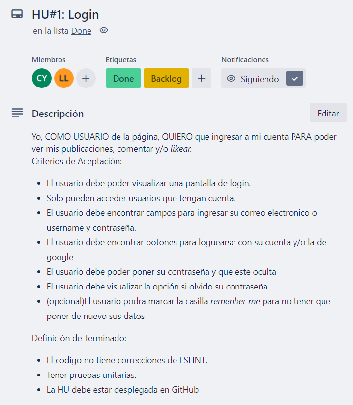
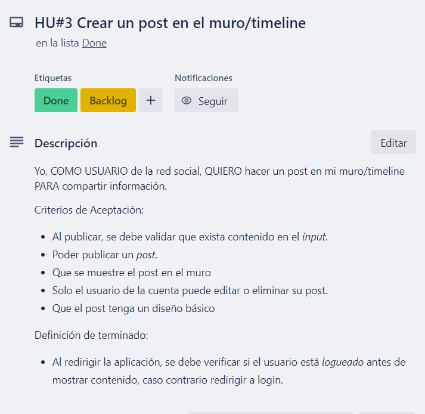
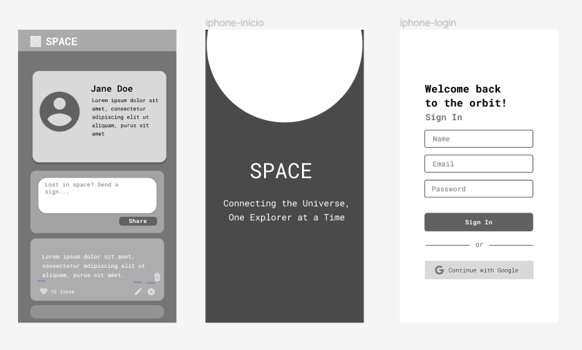
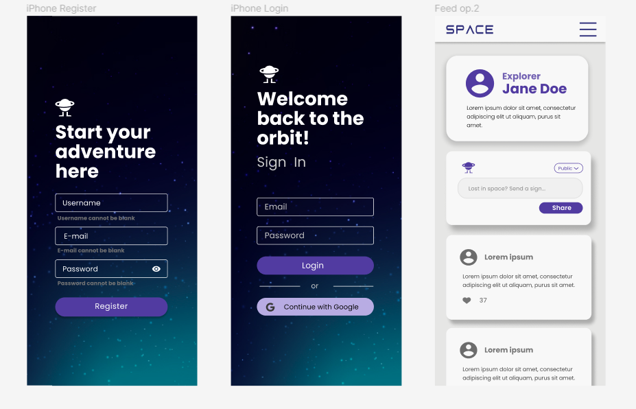
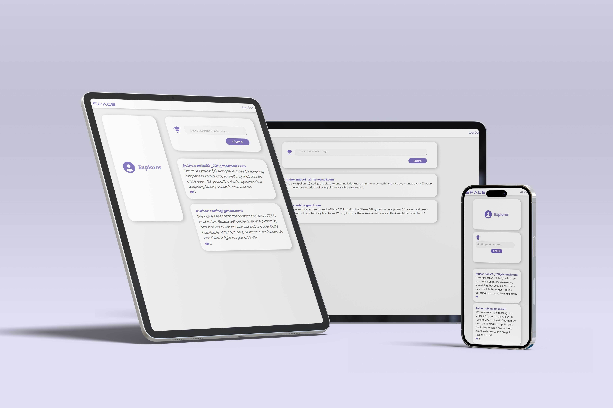
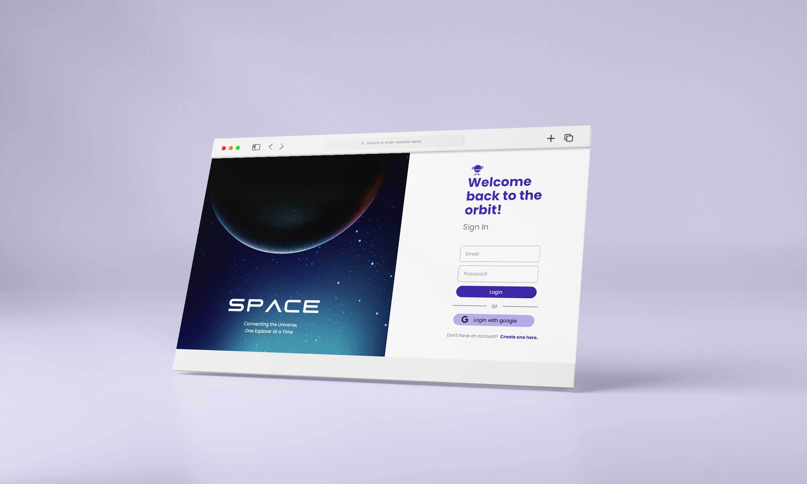

# _SPACE_

## Índice

* [1. Información del proyecto](#1-información-del-proyecto)
* [2. Consideraciones generales](#2-consideraciones-generales)
* [3. Historias de usuario](#3-historias-de-usuario)
* [4. Prototipos](#4-prototipos)
* [5. Producto final](#5-producto-final)
* [8. Créditos](#8-créditos)

## 1. Información del proyecto🌠
Este proyecto esta dirigido a todas aquellas personas amantes de la astronomía que deseen encontrar un espacio especial donde contribuir, intercambiar o compartir información acerca de los planetas, cometas, asteroides, constelaciones y todas las diversas entidades físicas que existen en el universo.

> Connecting the Universe,
>
> One Explorer at a Time
>🔭 🌠

## 2. Consideraciones generales🌀
Para este proyecto se usaron los siguientes conocimientos:

- [ ] HTML
- [ ] CSS
- [ ] Javascript vanilla

Las siguientes herramientas:

- [ ] Git
- [ ] GitHub
- [ ] Visual Code
- [ ] Figma

Cumpliendo los siguientes requisitos:
* SPA( _Single-page Apllication_ )
* Página _Responsive_
* Test unitarios
* Concepto _mobile first_

## 3. Historias de usuario 🪐
Desarrollamos las **_historias de usuario_** en base a las necesidades que pudimos observar y analizar de nuestro Público Objetivo.

## 4. Prototipos🌑
Para poder visualizar como deseamos que se vea la plataforma nos basamos en prototipos de baja y alta fidelidad.

### _Prototipo de baja fidelidad_

### _Prototipo de alta fidelidad_

## 5. Producto final✨
Puede ingresar [aqui]() para poder ver nuestra red social.

## 6. Issues
Funcionalidades por implementar:

* Posibilidad de poner foto de perfil y nombre de usuario
* Posibilidad de compartir publicaciones con fotos y enlaces
* Posibilidad de comentar publicaciones
* Posibilidad de seguir a otros usuarios
* Feed infinito con publicaciones de personas a las que sigues
* Publicaciones con sus respectivos nombres de usuario
* Snackbar que confirme registro exitoso

### 7. Créditos
Este trabajo fue creado con 💛 gracias a la colaboración de Carolyn Yaker, Linda Robles y Natalia Linares.